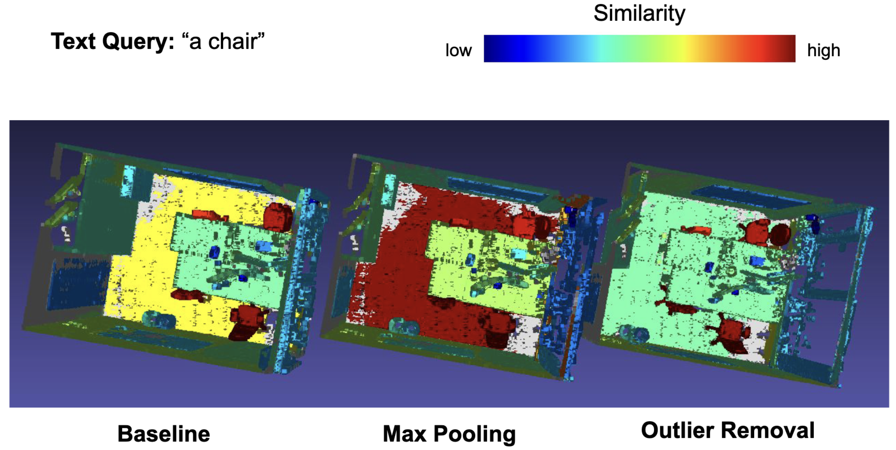

<p align="center">
  <h1 align="center">OpenMask3D++: Scaling Open-Vocabulary 3D Instance Segmentation to
Fine-Grained Semantic Annotations</h1>
  <p align="center">
    <a href="https://github.com/michaelnoi/">Michal Neumayr</a><sup></sup></span>, 
    <a href="https://github.com/michal-stary">Michael Stary</a><sup></sup>,
    <a href="https://pannek.dev">Simon Pannek</a><sup></sup>, 
    <a href="https://danielkorth.io/">Daniel Korth</a><sup></sup>
    <br>
    <sup></sup>Technical University of Munich
    <!-- <sup></sup>equal contribution -->
  </p>
  <!-- <h2 align="center">ML3D Project</h2> -->
  <h3 align="center"><a href="https://github.com/danielkorth/openmask3d">Code</a> | <a href="https://github.com/danielkorth/openmask3d/blob/main/ML3D_Report.pdf">Report</a> | <a href="https://github.com/danielkorth/openmask3d/blob/main/ML3D_Presentation.pdf">Presentation Slides</a> </h3>
  <div align="center"></div>
</p>
<p align="center">
  
</p>
This repository is part of the ML for 3D Geometry course by Prof. Dai at the Technical University of Munich. We modify the original codebase of <a href="https://github.com/OpenMask3D/openmask3d">OpenMask3D</a> by proposing and evaluating following approaches:

* Diverse Views: Enhance Semantic Scene Understanding by selecting more diverse views for the CLIP Embeddings</li>
* Outliers Removal: removing outliers in the embedding space to get more consistent semantic signals and experimenting with different aggregation fucntions</li>
* Foundation Models: Replace CLIP with SigLip and use DINOv2 to allow image queres of the 3D Scene</li>

---
# Setup 🛠

For setting up OpenMask3D, please refer to the official GitHub and follow their steps at from <a href="https://github.com/danielkorth/openmask3d">here</a>.

Once you have OpenMask3D installed and running, you need to download ScanNet++ and preprocess each scene with the following command:

```bash
python scannet++_to_openmask.py --scene_id $scene_id
```

Make sure to set the replace the paths in the file to match your local setup.

## Running our Modifications

You can try out modifications by running the script with following arguments:
* `path_to_scenes_txt`: the path to the scenes you want to have processed
* `num_views_precomputed`: 5 is the default from OpenMask3D. If you use more than 5, then it will select the 5 images per instance that will make it most diverse (in terms of camera angles)
* `model`: the foundation model to use. Select between `clip`, `siglip` and `dinov2`

```bash
bash run_openmask3d_selected_scenes_scannet++.sh $path_to_scenes_txt $num_views_precomputed $model
```


# Evaluation

## Visualization

Once you computed the instance masks for each scene, you can query it either via text or image. Querying via text works with `clip` and `siglip`, querying via image with `dinov2`

Following arguments need to be provide:
* `experiment_path`: Path to the scene in the respective experiment folder.
* `text`: The text to query.
* `remove_outliers`: whether to remove outlier embeddings or not. Default is False.
* `agg_fct`: Aggregation function over the embeddings; choose between `mean` (default) and `max`.

```bash
python openmask3d/visualization/vim_sim_score_export.py \
-e $experiment_path \
-t $text \
--remove_outliers $remove_outliers \
--agg_fct $agg_fct
```

If you want to query by image, replace `-t $text` with `-i path_to_image`.


## Quantitative Evaluation on ScanNet++

To quantitatively evaluate the results, use the following script with additional an additional argument `topk` which indicates whether you want to evaluate the model on top1, top5, or other `topk`. We use `1` for ScanNet200 and `5` for ScanNet++.

```bash
bash run_evaluation_scannet++.sh $experiment_path $remove_outliers $agg_fct $topk
```

